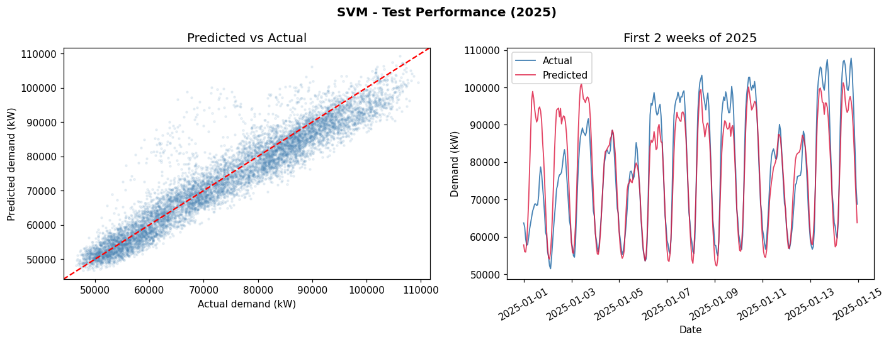
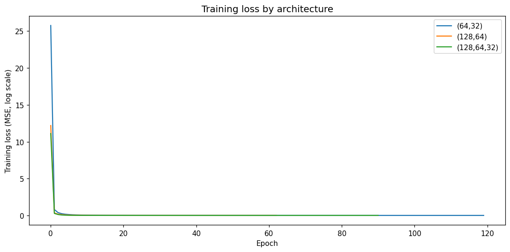
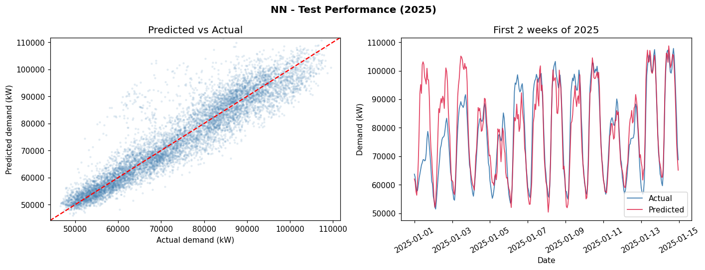
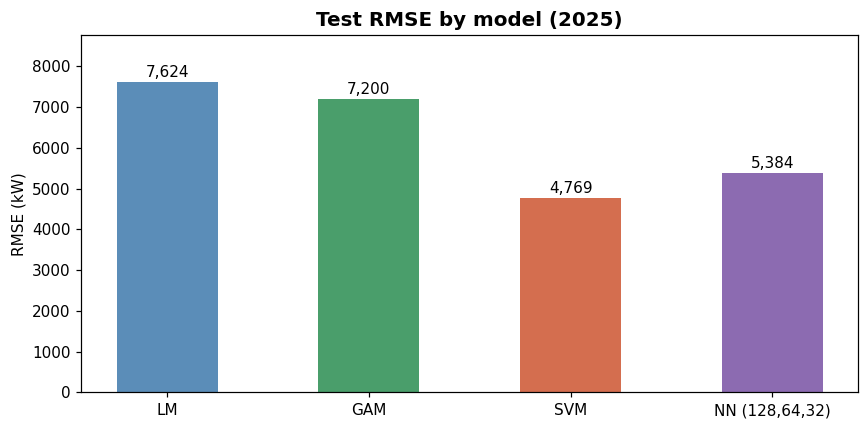

## Introduction

EWZ is the municipal electricity utility of Zurich. It supplies power to roughly 400,000 residents and several thousand commercial and industrial customers across the city. Like all distribution network operators, EWZ faces the problem of matching supply to demand in real time: generation or procurement has to be arranged hours or days in advance, so an accurate forecast of what demand will look like in the coming hours has direct economic and operational value. A forecast that is too low leads to emergency procurement at unfavourable prices; one that is too high wastes money on capacity that is not needed.

The bulk of variation in electricity demand is driven by two things: what time it is, and what the weather is like. Human activity follows daily and weekly rhythms, so demand at 3am on a Sunday is structurally different from demand at 9am on a Monday even without any weather effect. On top of that, temperature drives heating load in winter and cooling load on hot summer days, while solar radiation affects both the output of rooftop photovoltaic installations and, to a lesser extent, daylight that substitutes for artificial lighting.

Zurich's climate makes this problem particularly interesting. The city sits at 400 metres above sea level and has cold winters, warm summers, and highly variable cloud cover. Mean January temperatures are around 1-3°C, cold enough that a single-degree drop can trigger measurable extra heating load across the network. Summer peaks, while smaller than winter ones on average, can spike sharply during heatwaves.

We worked with open data published by the city of Zurich: 15-minute electricity demand readings from EWZ and hourly meteorological observations from the urban monitoring network. After merging and resampling to hourly resolution we had roughly 35,000 observations covering January 2022 through mid-2025. The training set uses 2022-2024 and the test set uses 2025.

We structured the forecasting problem around three research questions:

- **RQ1:** What weather and time variables drive hourly electricity demand, and how accurately can we predict it?
- **RQ2:** Can we predict whether a given hour will be a peak demand hour (top 10% of all demand)?
- **RQ3:** Can we model how many peak hours a day is likely to have?

Together these three framings let us use six different modelling approaches -- an OLS linear model, two GLMs (Poisson and Binomial), a GAM, an SVM, and a neural network -- and compare them in a controlled way.

## Data and Preprocessing

### Electricity Data

The raw EWZ file contains 15-minute readings separated by voltage level. NE5 covers medium-voltage consumers, primarily large commercial buildings, industrial sites, and infrastructure. NE7 covers low-voltage consumers, which are mainly households and small businesses. We summed NE5 and NE7 at each timestamp to get total grid demand and then resampled to hourly means. Using hourly means rather than 15-minute readings reduces high-frequency noise that comes from individual large consumers switching on and off, and it aligns with the resolution of the weather data.

The time index in the EWZ file is UTC. We converted to Zurich local time (Europe/Zurich, which is UTC+1 in winter and UTC+2 in summer) for all time-based features, so that hour-of-day variables reflect the actual local clock that governs human behaviour rather than UTC offsets that shift by an hour at each clock change.

### Weather Data

The city meteorological network (UGZ) operates four stations in Zurich. We evaluated all four and chose Zch_Stampfenbachstrasse for its completeness: it had fewer than 30 missing hourly values across the three-year period for any of the six variables we used (temperature, relative humidity, global solar radiation, rain duration, wind speed, and air pressure). The station is located in a residential and commercial area near the city centre, which makes it representative of the general urban environment rather than a specific microclimate.

Missing values in the merged dataset were handled by dropping the affected rows. Given that fewer than 30 rows per variable were missing out of 35,000 observations (below 0.1%), imputation would have introduced more assumptions than it resolved, so dropping was the cleaner choice.

### Feature Engineering

Several predictors were derived from the raw data rather than used directly. Hour-of-day and month-of-year are naturally cyclic: hour 23 and hour 0 are adjacent, not 23 units apart as raw integers would imply. We encoded both using sine and cosine transformations, producing pairs of features (hour_sin, hour_cos) and (month_sin, month_cos) that correctly represent the circular structure. A linear model using these encodings can recover any periodic pattern in one cycle with just two coefficients per period.

Season was added as a categorical variable with four levels (winter: Dec-Feb, spring: Mar-May, summer: Jun-Aug, autumn: Sep-Nov), with autumn as the reference category. This gives the models a way to distinguish regimes that the month cyclic features alone might not separate cleanly.

### Response Variables

Three response variables were constructed. `demand_log` is the natural logarithm of total hourly demand in kW. The log transform is appropriate because demand is always positive, the distribution is right-skewed, and multiplicative effects are common in this kind of data. An OLS model on the log scale is equivalent to a model where each predictor shifts demand by a percentage rather than an absolute amount.

`is_peak` is a binary indicator equal to 1 when demand exceeds the 90th percentile (95,305 kW). This threshold produces roughly 10% positive cases and corresponds to the genuinely high-demand hours that require active grid management decisions.

`peak_hours_per_day` counts how many peak hours occurred on each calendar day, aggregated from the hourly is_peak indicator. Most days have zero; the distribution is strongly right-skewed and zero-inflated.

### Dataset Summary

| Column | Type | Description |
|---|---|---|
| demand | float | Total hourly demand NE5+NE7 (kW) |
| T | float | Air temperature (C) |
| Hr | float | Relative humidity (%) |
| StrGlo | float | Global solar radiation (W/m2) |
| RainDur | float | Rain duration (min) |
| WVv | float | Wind speed (m/s) |
| p | float | Air pressure (hPa) |
| hour_sin / hour_cos | float | Cyclic encoding of hour |
| month_sin / month_cos | float | Cyclic encoding of month |
| is_weekend | int | 1 if Saturday or Sunday |
| demand_log | float | log(demand), regression target |
| is_peak | int | 1 if demand > p90, classification target |
| peak_hours_per_day | int | Count target for Poisson model |

## Exploratory Data Analysis

### Demand Distribution


Hourly demand ranges from about 46,000 kW to 110,000 kW with a mean around 74,000 kW and a standard deviation of roughly 13,000 kW. The distribution is unimodal with a slight right skew. There is a visible secondary bump at the high end, around 90,000-100,000 kW, which corresponds to winter heating peaks during cold weekday mornings. These are not statistical outliers but a genuine second regime in the data driven by low temperatures.

After applying the log transform, the distribution becomes close to symmetric with no heavy tails. The Q-Q plot of demand_log against a normal reference shows good alignment except at the extreme upper end. This supports the use of demand_log as the regression target: the log scale makes the error structure more homogeneous and the normality assumption in OLS more defensible.

### Time Series by Year


All four years show the same broad seasonal pattern: high demand from November through March, a minimum around July-August, and a secondary rise in autumn. The year-over-year overlap is tight: the 2022, 2023, and 2024 curves are nearly indistinguishable when plotted on the same axis, which indicates that the seasonal pattern is highly stable from year to year.

The 2025 partial year (used as the test set) also follows the expected pattern, which is an important sanity check: it confirms that 2025 is not a structural break from the training years. There is no visible trend in the baseline level of demand across years, which means a simple time trend term would add little.

The highest-demand hours across all years cluster in January and February on cold working days. The lowest are in late July and August on weekends. The ratio between the annual maximum and minimum is roughly 2.4, which indicates a substantial dynamic range that models must cover.

### Temporal Patterns


At the intraday level two peaks are visible. A morning peak around 8-9h corresponds to the start of the working day and morning domestic activity (cooking, showers, commute). An evening peak around 19-20h reflects the return home from work, cooking, and evening lighting. The evening peak is on average slightly higher than the morning one. Demand reaches its minimum between 3am and 5am when most activity has stopped.

The weekday versus weekend gap is consistent across all hours of the day and is largest during the standard working day (9am-6pm). On weekdays the morning peak is sharper because commercial and office loads switch on simultaneously. On weekends the morning ramp is more gradual and shifted about two hours later.

The monthly profile confirms the dominance of heating demand in Zurich's climate. January and December show average demand roughly 25,000 kW higher than July and August. The October-to-November transition is steep, reflecting the rapid increase in heating needs as autumn temperatures drop.

### Demand vs Weather


The scatterplot of demand against temperature has a clear negative slope at low temperatures (heating regime) that flattens and turns slightly upward above 25-30°C (cooling regime). The relationship is not linear: a straight line fits the 5-20°C range reasonably well but misses both the steep winter response below 5°C and the uptick at high summer temperatures. This non-linearity motivated the GAM, which can model it explicitly.

Humidity shows a weaker positive association with demand. High humidity tends to accompany lower temperatures in Zurich's climate, which may explain part of this correlation, but there is also some independent contribution from the discomfort effect at high relative humidity.

Solar radiation has an almost flat scatter against demand. This is largely a confounding effect: high radiation occurs only during daytime hours when demand is in a trough for other reasons. To see the solar effect one would need to partial out the hour-of-day contribution, which is what the partial dependence plot in the GAM section does.

### Correlation Heatmap


The hour cyclic features have the strongest linear correlations with demand in absolute value, around 0.5-0.6. Temperature follows at about -0.4. Month cyclic features contribute moderately. Among the weather variables, the pairwise correlations are generally low (below 0.3), which means they carry mostly non-redundant information and can all contribute to the model without causing severe multicollinearity. The most notable correlation among predictors is between temperature and month features (winter months have lower temperatures), which is expected and acceptable.

The humidity-temperature correlation is around -0.4, which means the two carry partly overlapping information. This does not prevent both from being useful in a regression model, but it does mean that their individual coefficient estimates should be interpreted with some caution when the other is held fixed.

### Target Variables


About 10% of hours qualify as peak hours by the 90th percentile threshold. These hours are concentrated in winter (December through March) on weekday mornings. The proportion of peak hours in January is roughly eight times higher than in August. This severe imbalance between seasons means that a model trained without seasonal controls would learn almost nothing about the conditions for peak hours from the summer data.

The daily peak count distribution is heavily zero-inflated: roughly 55% of days have zero peak hours. The maximum observed is 13 consecutive peak hours in a single day during a cold January week. Most days with non-zero peak counts have between 1 and 4. This right-skewed count distribution is the primary motivation for using a Poisson GLM for the daily count target.

## Modelling

All regression models use `demand_log` as the response variable and are trained on the 2022-2024 subset (roughly 26,000 hourly observations), with 2025 held out as a test set (around 4,000 observations at time of writing). Performance metrics for regression are computed in original kW units after applying exp() to the predictions.

### Linear Model (OLS)

*Lead: Tamara Marcet*

**Approach.** An ordinary least squares model on demand_log is the natural starting point for a regression problem like this. It is fully transparent (every predictor has a single coefficient with a standard error and p-value), fast to train, and provides a clear interpretive baseline for comparing with more complex methods. The risk is that it can only model additive linear effects, which may not be adequate when the relationship between a predictor and demand is curved or varies across conditions.

To make the comparison with non-linear methods as fair as possible, we included two interaction terms in the formula: T:hour_cos, which allows the temperature effect to vary by time of day, and T:is_weekend, which allows the temperature effect to differ between weekdays and weekends. Season entered as dummy variables with autumn as the reference category. These terms substantially improve the LM without changing its basic character as a linear model.

**Results:** R2 (train) = 0.79, RMSE (test) = 7,624 kW (10.3% of mean demand), MAE = 6,126 kW.

<details>
<summary>Show code</summary>

```python
formula = (
    'demand_log ~ T + Hr + StrGlo + RainDur + WVv + p + '
    'hour_sin + hour_cos + month_sin + month_cos + '
    'is_weekend + C(season) + T:hour_cos + T:is_weekend'
)
model = smf.ols(formula, data=train).fit()

y_pred   = np.exp(model.predict(test_clean))
y_actual = np.exp(test_clean['demand_log'])
rmse = np.sqrt(mean_squared_error(y_actual, y_pred))
mae  = mean_absolute_error(y_actual, y_pred)
```

</details>


The residuals are roughly normally distributed and centred on zero, which supports the OLS assumptions. The Q-Q plot follows the normal line closely in the central range but shows some excess at the upper tail: the most extreme high-demand hours produce larger residuals than a normal model would expect. The scale-location plot shows mild heteroscedasticity: residual variance is higher at the top of the fitted value range, which corresponds to winter peak hours. This does not bias the coefficient estimates but means the standard errors are slightly underestimated for the highest-demand regime.


In the scatter plot the bulk of predictions fall close to the diagonal, but the upper right corner shows systematic underprediction: actual values above 95,000 kW are consistently predicted lower than observed. This is the main weakness of the linear model and motivates the non-linear approaches in later sections. The two-week January 2025 time series shows that the daily cycle and weekday/weekend contrast are well captured, but the sharpest cold-morning peaks are smoothed out because the model cannot represent the steep temperature-demand relationship below 5°C.

**Coefficient interpretation.** The cyclic hour features dominate the model, which is expected since the daily cycle accounts for the largest share of demand variation. Temperature has a coefficient of -0.0025 on the log scale: each 1°C increase reduces demand by approximately 0.25%, or about 185 kW at the mean. Over a 15°C swing from a mild autumn day to a cold January night, this translates to roughly 2,800 kW from temperature alone, before accounting for the interaction terms.

Weekends have a coefficient of -0.118: demand is about 11% lower on weekends than on equivalent weekdays after controlling for all other predictors. This reflects the reduced commercial and office load on non-working days.

Solar radiation has a coefficient of -0.0000577, meaning 100 W/m² of additional radiation reduces demand by around 0.6%. On a clear summer midday (600-700 W/m²) this corresponds to roughly 3-4% lower demand, consistent with the contribution of rooftop solar installed in the city.

The T:hour_cos interaction (0.0011) tells us the negative temperature effect is somewhat weaker during midday hours when hour_cos is near its maximum. Physically this makes sense: at midday, heating demand is more moderate even on cold days because some solar gain has accumulated in buildings. Humidity was the only predictor not significant at 5% (p = 0.056).

### GLM Poisson

*Lead: Tamara Marcet*

**Approach.** The daily peak hour count (peak_hours_per_day) is a non-negative integer, which makes ordinary linear regression a poor fit: OLS can predict negative counts and assumes normally distributed errors, neither of which is appropriate here. The Poisson generalised linear model is the standard choice for count responses. It uses a log link function, which means the linear predictor operates on the log of the expected count, automatically ensuring predictions are non-negative. Poisson regression also scales naturally with the mean: if mean peak count doubles, the variance doubles too, which is more realistic than assuming constant variance.

We aggregated the hourly data to daily observations for this model, taking daily average values for the weather predictors. A T:season interaction was included to allow temperature to have different effects in different seasons, which the EDA suggested would be important. We expected the temperature effect to reverse sign between winter (cold drives peaks) and summer (heat waves drive peaks).

**Results:** RMSE = 2.58 h/day, MAE = 1.44 h/day, R2 = 0.69. Overdispersion ratio = 1.82.

<details>
<summary>Show code</summary>

```python
formula = (
    'peak_hours_per_day ~ T + Hr + StrGlo + RainDur + WVv + p + '
    'dayofweek + month + is_weekend + C(season) + T:C(season)'
)
model = smf.glm(formula, data=train, family=sm.families.Poisson()).fit()

dispersion = model.deviance / model.df_resid  # 1.82

test['predicted'] = model.predict(test)
rmse = np.sqrt(mean_squared_error(test['peak_hours_per_day'], test['predicted']))
```

</details>


The rootogram (also called a hanging rootogram) plots the difference between observed and expected counts at each count value; bars touching zero indicate a good fit. The model fits the 0-2 range well, which covers the majority of days. It underestimates the frequency of days with 5 or more peak hours, suggesting the Poisson distribution is not capturing the full spread of the count. The deviance residual plot shows no obvious trend over time but more spread than expected from a well-calibrated Poisson model, which is the visual signature of overdispersion.


The weekly aggregated predictions track the seasonal pattern well. The model correctly forecasts near-zero peak counts through June-September 2025 and rising counts from October onward. It underestimates the highest winter weeks and overestimates some intermediate periods. Daily precision is limited because the model uses daily average weather: a day with a low average temperature might still produce peak hours only in the coldest morning hours, and a daily mean cannot represent that.

**Coefficient interpretation.** All coefficients are on the log scale so exponentiating gives rate ratios: how the expected count changes multiplicatively. The T:season interaction is the centrepiece of this model. In autumn (reference), each 1°C increase multiplies expected peak hours by exp(-0.148) = 0.86, a 14% reduction. This is the normal heating regime: warmer days have fewer peak hours. In winter the combined effect is exp(-0.148 + 0.046) = 0.90: still negative but weaker, because the threshold for heating demand is lower in winter. In summer the direction reverses: exp(-0.148 + 0.515) = 1.44, meaning each additional degree is associated with 44% more expected peak hours, capturing the air conditioning and cooling load on hot days.

Solar radiation has a rate ratio of approximately 0.99 per W/m², small per unit but cumulatively meaningful: a sunny day at 600 W/m² average would have expected peak counts about 45% lower than an identical dark day, consistent with solar generation reducing net demand.

The overdispersion ratio of 1.82 means the data variance is about 80% higher than the Poisson model expects. A negative binomial model, which adds a free dispersion parameter, would give better calibrated standard errors. For a first modelling pass the Poisson is appropriate, but the reported confidence intervals should be treated as optimistic.

### GLM Binomial

*Lead: Paula Barghout*

**Approach.** The binary is_peak variable calls for logistic regression: a Binomial GLM with a logit link. The logit link maps linear combinations of predictors onto the (0,1) interval via the logistic function, guaranteeing valid probability outputs. Unlike linear probability models, logistic regression respects the bounded nature of probabilities and avoids predictions outside [0,1] even for extreme predictor values.

We used the hourly dataset for this model, with is_peak as the response. The class imbalance (10% peak, 90% non-peak) is moderate and does not require oversampling at this level; we report precision and recall for both classes in the confusion matrix to make the imbalance visible. A T:hour_cos interaction was added because the temperature effect on peak probability should be strongest at the times of day when peak hours actually occur (cold winter mornings), not at midday.

**Results:** AUC = 0.96, accuracy = 94%, McFadden R2 = 0.53.

<details>
<summary>Show code</summary>

```python
formula = (
    'is_peak ~ T + Hr + StrGlo + RainDur + WVv + p + '
    'hour_sin + hour_cos + month_sin + month_cos + '
    'is_weekend + C(season) + T:hour_cos'
)
model = smf.glm(formula, data=train_clean, family=sm.families.Binomial()).fit()

y_prob = model.predict(test_clean)
y_pred = (y_prob >= 0.5).astype(int)
auc    = roc_auc_score(y_true, y_prob)
```

</details>


The calibration curve shows predicted probabilities tracking observed frequencies well in the 0-0.4 range, which covers most hours. There is slight overestimation in the 0.4-0.7 range. The probability histograms by true class show good separation: the non-peak class is concentrated near zero (most hours are clearly not peaks), while the peak class has a wider spread reflecting genuine uncertainty about borderline hours. A well-calibrated model should show non-peak concentrated near 0 and peak concentrated near 1; the remaining overlap corresponds to hours where the weather and time features alone are not conclusive.


The ROC curve at AUC 0.96 is excellent for a model that uses only weather and time features. The confusion matrix at threshold 0.5 shows 97% recall for non-peak hours but 65% recall for actual peak hours. The low peak recall is a direct consequence of the conservative threshold: a model that predicts "non-peak" for every observation would get 0% peak recall but 90% overall accuracy given the class balance. Moving the decision threshold from 0.5 to around 0.3 would substantially increase peak recall at the cost of more false alarms, which may be acceptable in operational contexts where missing a peak is more costly than a false alert.

**Coefficient interpretation.** Temperature has an odds ratio of exp(-0.172) = 0.84: each 1°C increase reduces the odds of a peak hour by about 16%. Solar radiation has an odds ratio of 0.9991 per W/m²: small individually, but at 600 W/m² the odds of a peak hour are about 42% lower than at zero radiation, consistent with solar panels on buildings reducing net load.

The hour cyclic features are the strongest predictors in the model. The coefficient on hour_cos translates to an odds ratio of 0.05, meaning midday hours have odds 95% lower than the reference. This is consistent with the fact that peaks occur in the morning and evening, not at midday. Season effects are also strong: summer has a much higher baseline peak probability than autumn after controlling for temperature, reflecting heat wave peaks that drive demand from a different mechanism than winter heating.

### GAM

*Lead: Paula Barghout*

**Approach.** A generalised additive model replaces the global linear slope of each predictor with a smooth, data-driven function estimated from splines. The model is still additive (no automatic interactions between predictors) but is no longer constrained to linearity in any individual variable. This makes GAMs a natural bridge between the fully parametric LM and the fully non-parametric SVM: they can capture the non-linear temperature-demand relationship identified in the EDA while keeping the model interpretable through partial dependence plots.

We used LinearGAM from the pygam library with spline terms (s()) for the variables most likely to have non-linear effects: temperature, humidity, radiation, and the cyclic hour and month features. Linear terms (l()) were used for rain duration, wind, pressure, and is_weekend, where non-linearity was not expected. Season entered as a factor term (f()). The smoothing parameter lambda controls the trade-off between fit and smoothness across all spline terms simultaneously; we selected it via a grid search over 25 values from 0.001 to 1000 using generalised cross-validation (GCV), which balances in-sample fit against model complexity without requiring a separate validation set. The GCV selected lambda = 0.032.

**Results:** R2 (train) = 0.81, RMSE (test) = 7,200 kW (9.7% of mean demand), MAE = 5,829 kW.

<details>
<summary>Show code</summary>

```python
from pygam import LinearGAM, s, l, f

gam = LinearGAM(
    s(0) + s(1) + s(2) +           # T, Hr, StrGlo
    s(3) + s(4) + s(5) + s(6) +    # hour_sin, hour_cos, month_sin, month_cos
    l(7) + l(8) + l(9) + l(10) +   # RainDur, WVv, p, is_weekend
    f(11)                           # season_num
)
gam.gridsearch(X_train, y_train, lam=np.logspace(-3, 3, 25), progress=False)

y_pred   = np.exp(gam.predict(X_test))
rmse = np.sqrt(mean_squared_error(np.exp(y_test), y_pred))
```

</details>


The partial dependence plots show the fitted smooth effect of each predictor on demand_log, holding all other predictors at their median values. Temperature shows a clear J-shape: demand increases steeply below about 5°C, stays relatively flat between 10 and 25°C, and rises again above 30°C. The steep low-temperature section corresponds to heating load switching on; the flat middle range is the comfort zone where neither heating nor cooling is needed; and the slight high-temperature upturn reflects air conditioning and industrial cooling. This is the most important result from the GAM: it demonstrates concretely that the linear slope in the OLS model, while a useful approximation, systematically misrepresents the extremes.

Humidity shows a mild positive smooth effect that flattens above 70%. Solar radiation has a negative partial effect concentrated in the 200-800 W/m² range, consistent with the contribution of rooftop solar at midday. The hour cyclic features reproduce the double-peak shape clearly in the partial plots.


The GAM residual diagnostics look similar to those from the LM. Residuals are close to normally distributed in the bulk, with the same upper tail excess at very high demand hours. The residuals vs fitted values plot shows no strong trend, which means the spline terms are capturing the systematic curvature that was visible in the LM diagnostics. The marginal improvement in fit compared to the LM suggests that linearity was the main constraint in the simpler model.


The GAM reduces RMSE from 7,624 kW (LM) to 7,200 kW, a 5.5% improvement. This modest gain indicates that the non-linear temperature term and the other smooth effects provide some benefit but that the overall model structure (additive, weather and time features only) is still the binding constraint. The two-week time series shows nearly overlapping predictions from the GAM and LM, with the GAM fitting the coldest mornings slightly better. The systematic underprediction at the very highest demand hours persists in both models, pointing to the need for interaction effects or more expressive model classes.

### SVM

*Lead: Elena Fuchs*

**Approach.** Support vector regression (SVR) with a radial basis function (RBF) kernel maps the input features into a high-dimensional space where complex non-linear patterns become linearly separable. The RBF kernel computes similarity between two observations as exp(-gamma * ||x - x'||^2): training points close together in feature space have high similarity and therefore influence each other's predictions strongly. The hyperparameters C and gamma jointly control the fit: C sets the penalty for exceeding the regression tube (higher C = tighter fit to training data, lower regularisation), and gamma sets the kernel bandwidth (lower gamma = each support vector has broader influence).

SVR training is O(n^2) in the number of observations, which is prohibitive on 26,000 rows. We drew a subsample of 10,000 points from the training set using np.sort on the drawn indices to preserve temporal order (important for time-series data), then ran a three-fold grid search over C in [0.1, 1, 10, 100] and gamma in ['scale', 0.01, 0.1] to find the best hyperparameters before training the final model on the same 10K subsample.

**Results:** RMSE (test) = 4,769 kW (6.4% of mean demand), MAE = 3,481 kW. Best hyperparameters: C = 100, gamma = 0.01.

<details>
<summary>Show code</summary>

```python
rng = np.random.default_rng(42)
idx = np.sort(rng.choice(len(X_train), size=10_000, replace=False))
X_sub, y_sub = X_train[idx], y_train[idx]

gs = GridSearchCV(
    SVR(kernel='rbf'),
    {'C': [0.1, 1, 10, 100], 'gamma': ['scale', 0.01, 0.1]},
    cv=3, scoring='neg_mean_squared_error', n_jobs=-1
)
gs.fit(X_sub, y_sub)

svr = SVR(kernel='rbf', C=100, gamma=0.01)
svr.fit(X_sub, y_sub)

y_pred   = np.exp(svr.predict(X_test))
rmse = np.sqrt(mean_squared_error(np.exp(y_test), y_pred))
```

</details>



The SVM substantially outperforms both parametric models. In the scatter plot the cloud of points is tighter around the diagonal, and the upper right region (actual demand above 90,000 kW) is predicted far more accurately. The LM and GAM showed a systematic cluster of underpredicted high-demand points in this region; in the SVM plot these points lie much closer to the diagonal. This improvement is the direct consequence of the RBF kernel capturing temperature-hour and temperature-season interactions that the additive models either do not have or can only represent imperfectly.

The two-week January 2025 time series confirms this: the SVM predictions follow the shape of the actual peaks more closely, with less smoothing of the cold-morning spikes. The gain over the LM is roughly 37% lower RMSE, which is large enough to be practically significant for a grid operator.

The grid search result provides some interpretive information. The selected C = 100 means the model applies minimal regularisation and is allowed to fit closely to the training data; given the 10K subsample this risk of overfitting is limited. The selected gamma = 0.01 (lower than the default 'scale') means each support vector has a relatively wide influence area in feature space, which helps the model interpolate smoothly across the test observations. A total of several thousand support vectors were retained, which is consistent with typical RBF-SVR behaviour on moderately complex data.

### Neural Network (MLP)

*Lead: Elena Fuchs*

**Approach.** A multi-layer perceptron (MLP) is a feedforward neural network with one or more hidden layers of neurons using non-linear activation functions. Each neuron applies a weighted sum of its inputs followed by a ReLU activation (max(0, x)), which allows the network to learn arbitrary non-linear functions through composition of simple transformations. Unlike SVR, the MLP does not require a subsample because stochastic gradient descent (Adam optimiser) scales to the full training set. We used sklearn's MLPRegressor for straightforward integration with the existing preprocessing pipeline.

We compared three architectures to assess the effect of depth and width: (64,32) with two small layers, (128,64) with two larger layers, and (128,64,32) with three layers. All were trained with early stopping, holding back 10% of the training data as a validation set and stopping when validation loss did not improve for a set number of iterations. This prevents overfitting without the need for a manual epoch count.

**Results:** RMSE (test) = 5,384 kW (7.3% of mean demand), MAE = 3,792 kW. Best architecture: (128,64,32).

<details>
<summary>Show code</summary>

```python
architectures = {'(64,32)': (64,32), '(128,64)': (128,64), '(128,64,32)': (128,64,32)}

trained = {}
for name, layers in architectures.items():
    mlp = MLPRegressor(
        hidden_layer_sizes=layers, activation='relu', solver='adam',
        early_stopping=True, validation_fraction=0.1,
        max_iter=500, random_state=42
    )
    mlp.fit(X_train, y_train)
    trained[name] = mlp

best_name = min(trained, key=lambda k: min(trained[k].loss_curve_))
best_mlp  = trained[best_name]
y_pred    = np.exp(best_mlp.predict(X_test))
```

</details>



All three architectures converge in under 120 epochs. The (128,64,32) network reaches a slightly lower training loss than the other two, but the differences are small and converged values are close. There is no sign of instability or oscillation in any of the curves, which means the Adam default learning rate is appropriate for this dataset. Early stopping terminates training before any architecture reaches 500 iterations, suggesting that overfitting would become a concern with more epochs but is well controlled here.

The small gap between architectures indicates that the expressiveness of the network is not the binding constraint for this dataset. Increasing depth further would likely not help without also increasing the training set size or using regularisation techniques like dropout.



The NN performs between the parametric models and the SVM: RMSE 5,384 kW versus 7,624 kW (LM) and 4,769 kW (SVM). The scatter plot shows a tighter cloud than the LM and better coverage of the upper demand range, but the SVM remains more accurate on the most extreme values. One plausible reason is that the SVR with a well-tuned RBF kernel is effectively a non-parametric kernel smoother with a known-good functional form for this type of data, while the MLP must learn this structure from weights. With 11 input features and a training set of 26,000 rows, the MLP has enough data to learn but may not have as good an inductive bias as the kernel. More careful tuning of learning rate, weight decay, and network width might close the gap; that is left for future work.

## Cross-Validation

To validate the kernel choice for the SVM and to check that the RBF result is not specific to a single train-test split, we ran a TimeSeriesSplit cross-validation on the training data (2022-2024) comparing three kernels: linear, RBF (C=100, gamma=0.01), and polynomial of degree 3. The same 10K temporal subsample was used for all three kernels to keep the comparison fair.

TimeSeriesSplit is the correct cross-validation strategy for time series data. It creates 5 folds where each validation set is always strictly in the future relative to all training data in that fold. This respects the temporal order of the observations and prevents information leakage from future observations into past predictions. Random KFold would allow a model to train on 2024 observations and validate on 2022 observations, effectively giving it future information during training and producing artificially optimistic estimates that would not hold at deployment time.


| Kernel | RMSE mean (kW) | RMSE std | MAE mean (kW) | MAE std |
|---|---|---|---|---|
| linear | 7,994 | 467 | 6,402 | 346 |
| RBF | 5,392 | 235 | 3,936 | 278 |
| poly3 | 7,265 | 1,528 | 5,611 | 1,397 |

RBF outperforms both alternatives on every fold. Its fold-to-fold standard deviation (235 kW) is also the lowest, confirming consistency across different time periods in the training set. The polynomial kernel performs worse than linear on average and has a standard deviation more than six times higher than RBF, indicating overfitting on the smaller folds in earlier cross-validation rounds. Linear kernel performance (7,994 kW) is consistent with the OLS RMSE on the full test set (7,624 kW), which is a sanity check that the CV results are calibrated to the scale of the problem.

The cross-validation also confirms that none of the three kernels degrades badly on any single fold. All RMSE values stay within a factor of two of the mean, which means there are no pathological folds and the results are reliable. The RBF kernel is clearly the right choice, and the CV evidence makes that choice defensible beyond the single test set comparison.

## Model Comparison



**Regression models (target: demand in kW)**

| Model | RMSE (kW) | MAE (kW) | R2 train |
|---|---|---|---|
| LM | 7,624 | 6,126 | 0.79 |
| GAM | 7,200 | 5,829 | 0.81 |
| NN (128,64,32) | 5,384 | 3,792 | -- |
| SVM | 4,769 | 3,481 | -- |

**Classification and count models**

| Model | Task | Metric | Value |
|---|---|---|---|
| GLM Poisson | peak hours/day (count) | RMSE | 2.58 h/day |
| GLM Poisson | | R2 | 0.69 |
| GLM Binomial | is_peak (binary) | AUC | 0.96 |
| GLM Binomial | | Accuracy | 94% |

The four regression models show a clear progression: each step up in complexity reduces test RMSE. The LM establishes a baseline at 7,624 kW by treating all relationships as linear. The GAM's non-linear splines reduce RMSE by 5.5%, with most of the gain coming from the temperature curve. The bigger jump comes with the SVM and NN, which reduce RMSE by 37% and 29% respectively over the LM. These models capture interactions between temperature, hour, and season that the additive models cannot represent.

The comparison between SVM and NN is the most practically instructive. The SVM edges ahead despite training on only 10,000 points while the NN used all 26,000. A well-tuned RBF kernel is a strong baseline for tabular regression problems with a moderate number of features. With more careful hyperparameter tuning (learning rate schedules, dropout, wider layers) the NN might match or exceed the SVM; that is a natural next step.

It is worth noting that the comparison is not fully controlled. The SVM had a grid search over four values of C and three values of gamma. The LM and GAM used a fixed formula and GCV respectively. With the same hyperparameter effort applied to all models, the relative ranking might shift. The SVM's advantage is real, but some fraction of it reflects better tuning rather than purely better model class.

The GLM Binomial stands out as the clearest practical result. An AUC of 0.96 using only weather and time variables means peak hours are, by and large, predictable from publicly available data well in advance. This has direct relevance for grid operations: a model like this could flag high-probability peak hours the evening before, giving operators time to arrange additional capacity.

## Conclusions

**RQ1 -- What drives electricity demand?**

Temperature and time of day are the primary drivers, and their effects interact. The GAM partial dependence plot shows the clearest picture: demand rises steeply below 5°C (heating regime), stays flat between 10 and 25°C (neutral regime), and increases again above 30°C (cooling regime). This J-shape explains why simple linear temperature terms underperform in winter and on summer heatwave days. The daily cycle (hour features) is the single strongest source of predictable variation, accounting for a larger share of explained variance than any weather variable individually.

The SVM achieves the lowest test RMSE at 4,769 kW, which is 6.4% of mean demand. For reference, 4,769 kW is roughly equivalent to the simultaneous consumption of about 20,000 average Swiss households. Whether this precision is sufficient for operational use depends on the decision context, but it compares well with short-term forecasting benchmarks in the literature for distribution-network scale forecasting without lag features.

**RQ2 -- Can we predict peak hours?**

Yes, with high discriminative accuracy. The GLM Binomial reaches AUC 0.96 and 94% overall accuracy on the 2025 test set using only weather and time features. Peak hours are concentrated in cold winter weekday mornings, and the model has learned this structure cleanly. The main operational limitation is peak recall (65% at threshold 0.5), but this can be tuned by lowering the classification threshold. For a grid alarm application where a missed peak is more costly than a false alarm, a threshold around 0.3 would be more appropriate.

**RQ3 -- Can we model the daily count of peak hours?**

The Poisson GLM captures the seasonal trend with R2 = 0.69. The most informative coefficient is the T:season interaction, which reverses sign between winter and summer: in winter, higher temperatures reduce expected peak hours (less heating needed), while in summer, higher temperatures increase them (cooling load from heat waves). This asymmetry would be invisible in a model without the interaction term and has practical value for planning: summer peak risk is driven by hot spells, winter peak risk by cold ones, and the two regimes need different responses.

**Limitations**

None of our models include lag features. Electricity demand at hour t is highly correlated with demand at t-1 and t-24 (same hour the day before), and including these lags would likely produce a large improvement in RMSE, particularly for the SVM and NN. We excluded lags to keep the focus on the weather-and-time question, but this is the most obvious extension.

The meteorological data starts in 2022, giving us just under three years of training data. A longer historical series (five to ten years) would give the models more exposure to unusual weather years and improve the stability of seasonal estimates. In particular, the heat wave regime is based on relatively few summer extremes in three years.

The model comparison is not fully controlled in terms of tuning effort. The SVM received an explicit grid search while the LM and GAM used a pre-specified formula and automated GCV. A fairer comparison would apply equally thorough tuning to all models.

Finally, NE5 and NE7 are aggregated here into a single total demand figure. In practice, medium-voltage commercial load and low-voltage residential load have different daily profiles and different temperature sensitivities. Modelling them separately and then summing might improve accuracy at the aggregate level.

## Generative AI Usage

We used a generative AI assistant throughout the project for several different purposes. On the code side, it helped with structuring the notebooks, debugging issues like the sklearn 1.8 `best_loss_` attribute returning None with early stopping, and working through why TimeSeriesSplit is the right approach for time series cross-validation rather than random KFold. For concepts we used it to clarify things like overdispersion in Poisson models, how GCV selects the smoothing parameter in a GAM, and what the odds ratio interpretation of logistic regression coefficients means when a predictor is in log units.

What worked well was generating boilerplate: imports, standard plot templates, the HTML report structure, and error message explanations. These tasks are well-defined and the outputs were usually correct on the first try. It saved considerable time on repetitive setup.

What was harder or did not work well: getting coefficient interpretations right without manual checking. The tool would sometimes produce plausible-sounding but subtly wrong explanations, for example conflating the log-scale coefficient with the percentage change in the original scale, or not accounting for whether a variable had been standardised. It also could not make modelling decisions: whether to include a given interaction, whether the overdispersion in the Poisson model was severe enough to switch to negative binomial, or whether the GAM's GCV-selected lambda was too smooth. Those decisions required reading the diagnostics and thinking about the problem.

What we had to be careful about: outputs looked credible and were often syntactically correct code that ran without errors. Running without errors is not the same as doing the right thing. In one case the suggested SVR subsample code did not preserve temporal order in the indices, which we caught by reviewing the logic before running. We also rewrote all model-description text that sounded generic, did not use our actual numbers, or described a general concept rather than our specific result. The practice we followed was to treat AI output as a draft that always required verification against the actual model outputs and a rewrite for specificity.
