## The Challenge

> EWZ needs to know how much electricity Zurich will consume, hours before it happens. This report shows how machine learning can make that forecast reliable enough to act on.

EWZ is the municipal electricity utility of Zurich. It supplies power to roughly 400,000 residents and several thousand commercial and industrial customers across the city. Like all distribution network operators, EWZ faces the problem of matching supply to demand in real time: generation or procurement has to be arranged hours or days in advance, so an accurate forecast of what demand will look like in the coming hours has direct economic and operational value. A forecast that is too low leads to emergency procurement at unfavourable prices; one that is too high wastes money on capacity that is not needed.

The bulk of variation in electricity demand is driven by two things: what time it is, and what the weather is like. Human activity follows daily and weekly rhythms, so demand at 3am on a Sunday is structurally different from demand at 9am on a Monday even without any weather effect. On top of that, temperature drives heating load in winter and cooling load on hot summer days, while solar radiation affects both the output of rooftop photovoltaic installations and, to a lesser extent, daylight that substitutes for artificial lighting.

Zurich's climate makes this problem particularly interesting. The city sits at 400 metres above sea level and has cold winters, warm summers, and highly variable cloud cover. Mean January temperatures are around 1-3°C, cold enough that a single-degree drop can trigger measurable extra heating load across the network. Summer peaks, while smaller than winter ones on average, can spike sharply during heatwaves.

We worked with open data published by the city of Zurich: 15-minute electricity demand readings from EWZ and hourly meteorological observations from the urban monitoring network. After merging and resampling to hourly resolution we had roughly 35,000 observations covering January 2022 through mid-2025. The training set uses 2022-2024 and the test set uses 2025.

We structured the forecasting problem around three research questions:

- **RQ1:** What weather and time variables drive hourly electricity demand, and how accurately can we predict it?
- **RQ2:** Can we predict whether a given hour will be a peak demand hour (top 10% of all demand)?
- **RQ3:** Can we model how many peak hours a day is likely to have?

Together these three framings let us use six different modelling approaches -- an OLS linear model, two GLMs (Poisson and Binomial), a GAM, an SVM, and a neural network -- and compare them in a controlled way.

## Building the Dataset

> Before any model can learn, the data needs to be clean, consistent, and meaningful. This section describes how we turned raw grid readings and weather observations into a dataset ready for machine learning.

### Electricity Data

The raw EWZ file contains 15-minute readings separated by voltage level. NE5 covers medium-voltage consumers, primarily large commercial buildings, industrial sites, and infrastructure. NE7 covers low-voltage consumers, which are mainly households and small businesses. We summed NE5 and NE7 at each timestamp to get total grid demand and then resampled to hourly means. Using hourly means rather than 15-minute readings reduces high-frequency noise that comes from individual large consumers switching on and off, and it aligns with the resolution of the weather data.

The time index in the EWZ file is UTC. We converted to Zurich local time (Europe/Zurich, which is UTC+1 in winter and UTC+2 in summer) for all time-based features, so that hour-of-day variables reflect the actual local clock that governs human behaviour rather than UTC offsets that shift by an hour at each clock change.

### Weather Data

The city meteorological network (UGZ) operates four stations in Zurich. We evaluated all four and chose Zch_Stampfenbachstrasse for its completeness: it had fewer than 30 missing hourly values across the three-year period for any of the six variables we used (temperature, relative humidity, global solar radiation, rain duration, wind speed, and air pressure). The station is located in a residential and commercial area near the city centre, which makes it representative of the general urban environment rather than a specific microclimate.

Missing values in the merged dataset were handled by dropping the affected rows. Given that fewer than 30 rows per variable were missing out of 35,000 observations (below 0.1%), imputation would have introduced more assumptions than it resolved, so dropping was the cleaner choice.

### Feature Engineering

Several predictors were derived from the raw data rather than used directly. Hour-of-day and month-of-year are naturally cyclic: hour 23 and hour 0 are adjacent, not 23 units apart as raw integers would imply. We encoded both using sine and cosine transformations, producing pairs of features (hour_sin, hour_cos) and (month_sin, month_cos) that correctly represent the circular structure. A linear model using these encodings can recover any periodic pattern in one cycle with just two coefficients per period.

Season was added as a categorical variable with four levels (winter: Dec-Feb, spring: Mar-May, summer: Jun-Aug, autumn: Sep-Nov), with autumn as the reference category. This gives the models a way to distinguish regimes that the month cyclic features alone might not separate cleanly.

### Response Variables

Three response variables were constructed. `demand_log` is the natural logarithm of total hourly demand in kW. The log transform is appropriate because demand is always positive, the distribution is right-skewed, and multiplicative effects are common in this kind of data. An OLS model on the log scale is equivalent to a model where each predictor shifts demand by a percentage rather than an absolute amount.

`is_peak` is a binary indicator equal to 1 when demand exceeds the 90th percentile (95,305 kW). This threshold produces roughly 10% positive cases and corresponds to the genuinely high-demand hours that require active grid management decisions.

`peak_hours_per_day` counts how many peak hours occurred on each calendar day, aggregated from the hourly is_peak indicator. Most days have zero; the distribution is strongly right-skewed and zero-inflated.

### Dataset Summary

| Column | Type | Description |
|---|---|---|
| demand | float | Total hourly demand NE5+NE7 (kW) |
| T | float | Air temperature (°C) |
| Hr | float | Relative humidity (%) |
| StrGlo | float | Global solar radiation (W/m²) |
| RainDur | float | Rain duration (min) |
| WVv | float | Wind speed (m/s) |
| p | float | Air pressure (hPa) |
| hour_sin / hour_cos | float | Cyclic encoding of hour |
| month_sin / month_cos | float | Cyclic encoding of month |
| is_weekend | int | 1 if Saturday or Sunday |
| demand_log | float | log(demand), regression target |
| is_peak | int | 1 if demand > p90, classification target |
| peak_hours_per_day | int | Count target for Poisson model |

## When and Why Does Zurich Use Electricity?

> Before fitting any model, we look at the data directly. The patterns here, daily rhythms, seasonal swings, temperature effects, are the intuition behind every model that follows.

### Demand Distribution

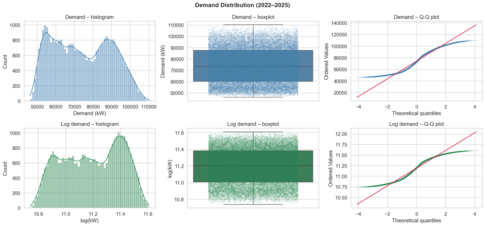

Hourly demand ranges from about 46,000 kW to 110,000 kW with a mean around 74,000 kW and a standard deviation of roughly 13,000 kW. The distribution is unimodal with a slight right skew. There is a visible secondary bump at the high end, around 90,000-100,000 kW, which corresponds to winter heating peaks during cold weekday mornings. These are not statistical outliers but a genuine second regime in the data driven by low temperatures.

After applying the log transform, the distribution becomes close to symmetric with no heavy tails. The Q-Q plot of demand_log against a normal reference shows good alignment except at the extreme upper end, confirming that the log scale makes the error structure more homogeneous and the normality assumption in OLS more defensible.

### Time Series by Year

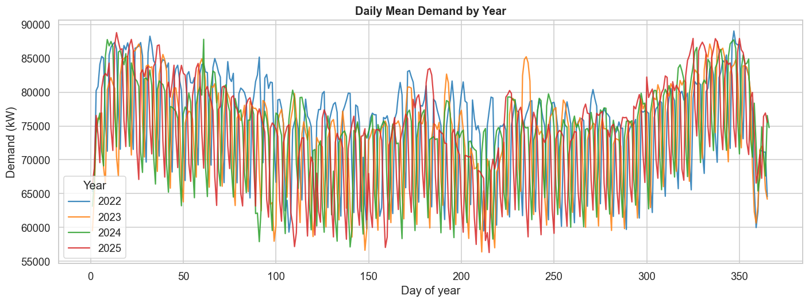

All four years show the same broad seasonal pattern: high demand from November through March, a minimum around July-August, and a secondary rise in autumn. The year-over-year overlap is tight: the 2022, 2023, and 2024 curves are nearly indistinguishable when plotted on the same axis, which indicates that the seasonal pattern is highly stable from year to year.

The 2025 partial year (used as the test set) also follows the expected pattern, which is an important sanity check: it confirms that 2025 is not a structural break from the training years. There is no visible trend in the baseline level of demand across years, which means a simple time trend term would add little.

The highest-demand hours across all years cluster in January and February on cold working days. The lowest are in late July and August on weekends. The ratio between the annual maximum and minimum is roughly 2.4, which indicates a substantial dynamic range that models must cover.

### Temporal Patterns

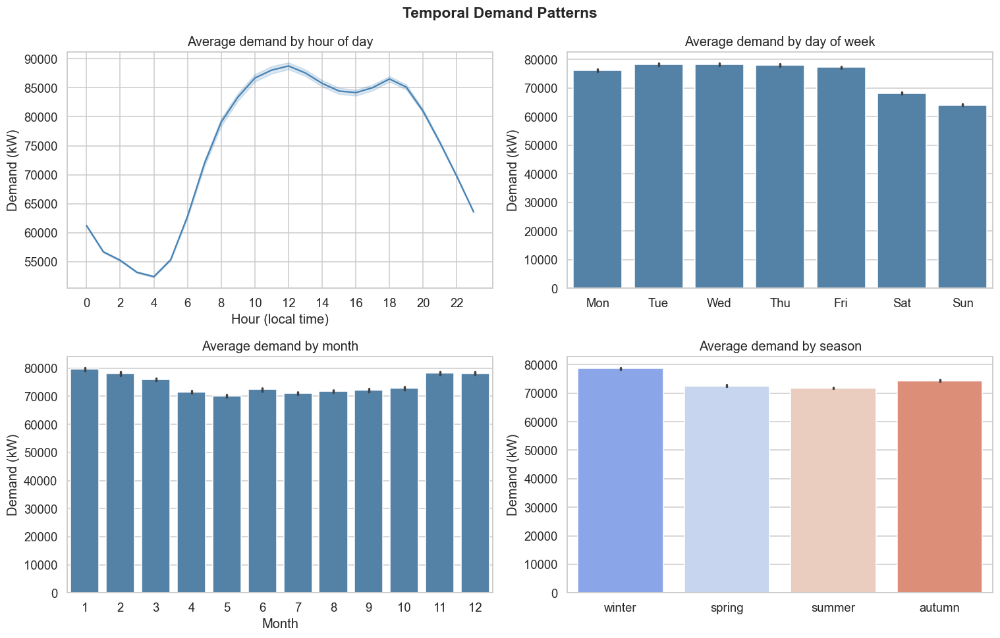

At the intraday level two peaks are visible. A morning peak around 8-9h corresponds to the start of the working day and morning domestic activity (cooking, showers, commute). An evening peak around 19-20h reflects the return home from work, cooking, and evening lighting. The evening peak is on average slightly higher than the morning one. Demand reaches its minimum between 3am and 5am when most activity has stopped.

The weekday versus weekend gap is consistent across all hours of the day and is largest during the standard working day (9am-6pm). On weekdays the morning peak is sharper because commercial and office loads switch on simultaneously. On weekends the morning ramp is more gradual and shifted about two hours later.

The monthly profile confirms the dominance of heating demand in Zurich's climate. January and December show average demand roughly 25,000 kW higher than July and August. The October-to-November transition is steep, reflecting the rapid increase in heating needs as autumn temperatures drop. Error bars show 95% Confidence Intervals of the mean.

### Demand vs Weather

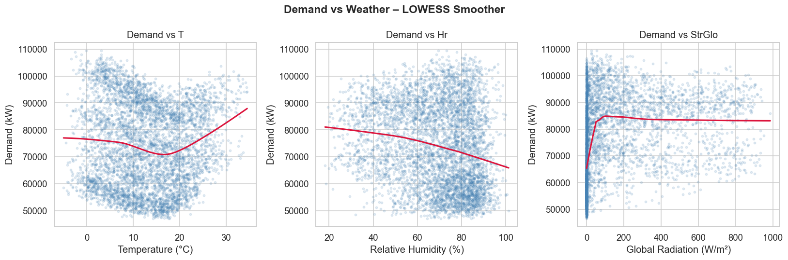

The scatterplot of demand against temperature has a clear negative slope at low temperatures (heating regime) that flattens and turns slightly upward above approximately 18°C (cooling/AC regime). The relationship is not linear: a straight line fits the 5-20°C range reasonably well but misses both the steep winter response below 5°C and the uptick at high summer temperatures. This non-linearity motivated the GAM, which can model it explicitly.

Humidity shows a weaker association with demand. Note that the negative humidity coefficient seen in regression models is likely an artefact of multicollinearity: humidity correlates with both rain duration and temperature, so once those variables are in the model, humidity's coefficient can flip sign. This contradicts physical reality (higher humidity increases AC demand) and should be interpreted with caution.

Solar radiation has an almost flat scatter against demand. This is largely a confounding effect: high radiation occurs only during daytime hours when demand is in a trough for other reasons. To see the solar effect one would need to partial out the hour-of-day contribution, which is what the partial dependence plot in the GAM section does.

### Correlation Heatmap

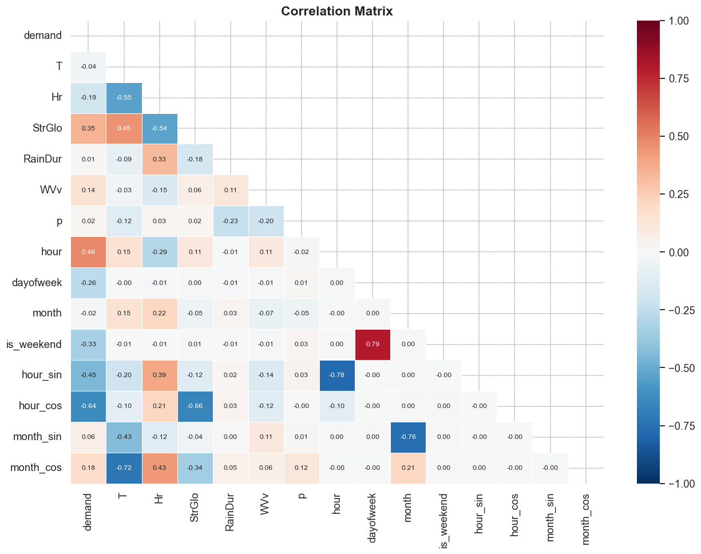

The hour cyclic features have the strongest linear correlations with demand in absolute value, around 0.5-0.6. Temperature follows at about -0.4. Month cyclic features contribute moderately. Among the weather variables, the pairwise correlations are generally low (below 0.3), which means they carry mostly non-redundant information and can all contribute to the model without causing severe multicollinearity. The most notable correlation among predictors is between temperature and month features (winter months have lower temperatures), which is expected and acceptable.

The humidity-temperature correlation is around -0.4, which means the two carry partly overlapping information. This does not prevent both from being useful in a regression model, but it does mean that their individual coefficient estimates should be interpreted with caution when the other is held fixed.

### Target Variables

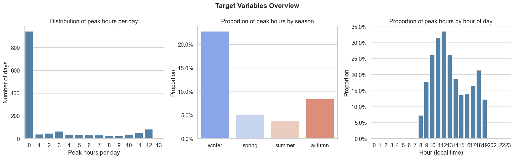

About 10% of hours qualify as peak hours by the 90th percentile threshold. These hours are concentrated in winter (December through March) on weekday mornings. The proportion of peak hours in January is roughly eight times higher than in August. This severe imbalance between seasons means that a model trained without seasonal controls would learn almost nothing about the conditions for peak hours from the summer data.

The daily peak count distribution is heavily zero-inflated: roughly 55% of days have zero peak hours. The histogram above filters these out to show the shape of non-zero days: most have between 1 and 4 peak hours, with the maximum being 13 consecutive peak hours in a cold January week. This right-skewed count distribution is the primary motivation for using a Poisson GLM for the daily count target.

## Six Models, One Question

> We apply six modelling approaches of increasing complexity. Each one answers a slightly different question about demand, and together they tell a complete story about what drives electricity consumption in Zurich.

All regression models use `demand_log` as the response variable and are trained on the 2022-2024 subset (roughly 26,000 hourly observations), with 2025 held out as a test set. Performance metrics for regression are computed in original kW units after applying exp() to the predictions.

### Linear Model (OLS)

Lead: Tamara Marcet

#### Approach

An ordinary least squares model on demand_log is the natural starting point. It is fully transparent, fast to train, and provides a clear interpretive baseline. The risk is that it can only model additive linear effects. To make the comparison with non-linear methods as fair as possible, we included two interaction terms: T:hour_cos and T:is_weekend. Season entered as dummy variables with autumn as the reference category.

#### Results

R² (train) = 0.79, RMSE (test) = 7,624 kW (10.3% of mean demand), MAE = 6,126 kW.

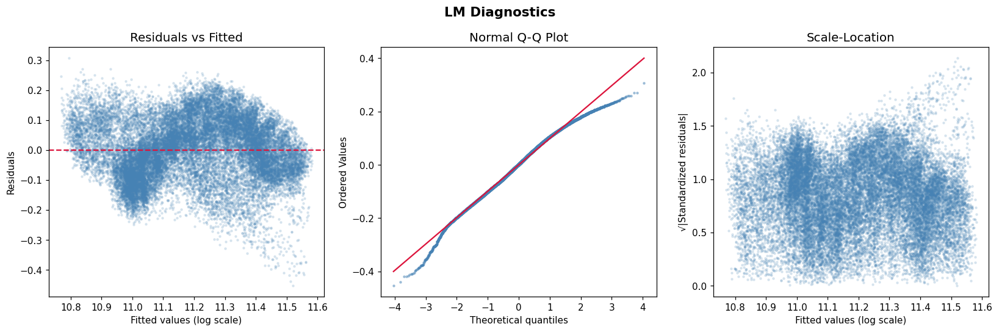

The residuals are roughly normally distributed and centred on zero, which supports the OLS assumptions. Note that this Q-Q plot tests the normality of the *residuals*, a core OLS assumptionwhich is distinct from the Q-Q plot in Section 3.1 that examined the raw demand distribution. Deviation in the tails means inference (p-values, confidence intervals) may be unreliable for the most extreme observations. The scale-location plot shows mild heteroscedasticity: residual variance is higher at the top of the fitted value range, corresponding to winter peak hours.

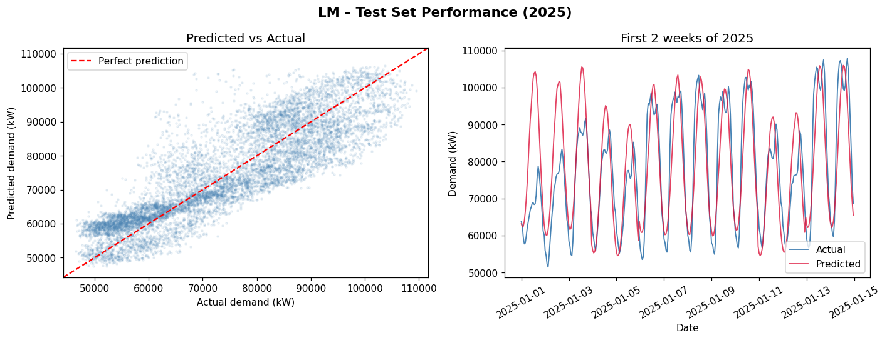

In the scatter plot the bulk of predictions fall close to the diagonal, but the upper right corner shows systematic underprediction: actual values above 95,000 kW are consistently predicted lower than observed. The two-week January 2025 time series shows that the daily cycle and weekday/weekend contrast are well captured, but the sharpest cold-morning peaks are smoothed out because the model cannot represent the steep temperature-demand relationship below 5°C.

#### Coefficient interpretation

The cyclic hour features dominate the model. Temperature has a coefficient of -0.0025 on the log scale: each 1°C increase reduces demand by approximately 0.25%, or about 185 kW at the mean. Weekends have a coefficient of -0.118: demand is about 11% lower on weekends than on equivalent weekdays. The T:hour_cos interaction (0.0011) tells us the negative temperature effect is somewhat weaker during midday hours. Humidity was the only predictor not significant at 5% (p = 0.056).

#### Cyclic encoding limitation

A single sine/cosine pair (one harmonic) can only represent a unimodal daily pattern, one peak and one trough per 24 hours. Zurich's electricity demand follows a bimodal daily curve however, with a morning peak (~8–9h) and an evening peak (~19–20h). A single harmonic cannot fit both peaks simultaneously. Higher-order Fourier terms or treating hour as a categorical variable would capture this more accurately.

### GLM Poisson

Lead: Tamara Marcet

#### Approach

The daily peak hour count (peak_hours_per_day) is a non-negative integer, which makes OLS a poor fit. The Poisson GLM uses a log link function, ensuring predictions are non-negative, and scales variance with the mean. We aggregated to daily observations and included a T:season interaction to allow temperature to have different effects in different seasons.

#### Results

RMSE = 2.58 h/day, MAE = 1.44 h/day, R² = 0.69. Overdispersion ratio = 1.82.

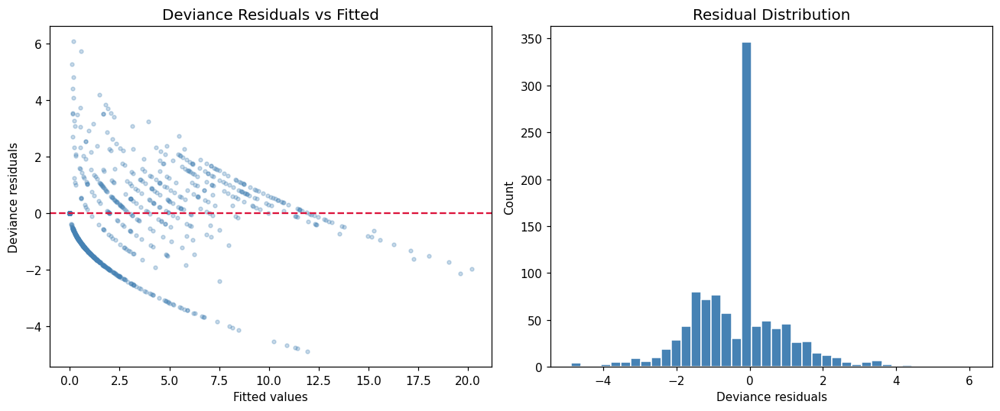

The rootogram shows the model fits the 0-2 range well but underestimates days with 5 or more peak hours. The deviance residual plot shows more spread than expected from a well-calibrated Poisson modelthe visual signature of overdispersion.

#### Overdispersion note

The Poisson model assumes variance equals the mean. With a dispersion ratio of 1.82, the data has about 80% more variance than the model expects a known limitation compounded by the zero-inflation in the target. A **Negative Binomial GLM** would be the technically superior alternative, as it adds a free dispersion parameter that absorbs this extra variance and produces better-calibrated standard errors.

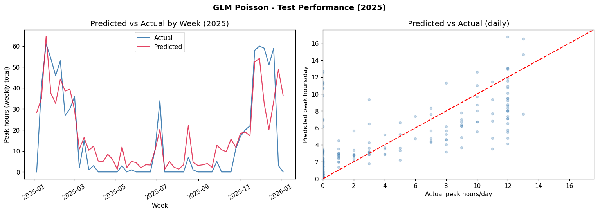

The weekly aggregated predictions track the seasonal pattern well. The model correctly forecasts near-zero peak counts through June-September 2025 and rising counts from October onward. It underestimates the highest winter weeks and overestimates some intermediate periods.

#### Coefficient interpretation

All coefficients are on the log scale so exponentiating gives rate ratios. In autumn (reference), each 1°C increase multiplies expected peak hours by exp(-0.148) = 0.86, a 14% reduction. In summer the direction reverses: exp(-0.148 + 0.515) = 1.44, meaning each additional degree is associated with 44% more expected peak hours, capturing air conditioning load on hot days.

### GLM Binomial

Lead: Paula Barghout

#### Approach

The binary is_peak variable calls for logistic regression: a Binomial GLM with a logit link. The logit link maps linear combinations of predictors onto the (0,1) interval, guaranteeing valid probability outputs. The class imbalance (10% peak, 90% non-peak) is moderate and does not require oversampling at this level. A T:hour_cos interaction was added because the temperature effect on peak probability should be strongest at the times of day when peak hours actually occur.

#### Results

AUC = 0.96, accuracy = 94%, McFadden R² = 0.53.

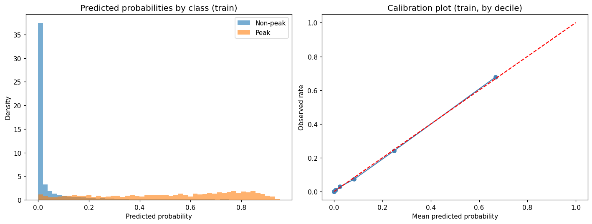

The calibration curve shows predicted probabilities tracking observed frequencies well in the 0-0.4 range. The probability histograms by true class show good separation: the non-peak class is concentrated near zero while the peak class has a wider spread reflecting genuine uncertainty about borderline hours.

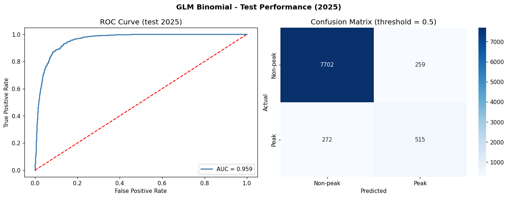

The ROC curve at AUC 0.96 is excellent for a model using only weather and time features. The confusion matrix at threshold 0.5 shows 97% recall for non-peak hours but 65% recall for actual peak hours. Moving the threshold from 0.5 to around 0.3 would substantially increase peak recall at the cost of more false alarms acceptable in operational contexts where missing a peak is more costly than a false alert.

#### Coefficient interpretation

Temperature has an odds ratio of exp(-0.172) = 0.84: each 1°C increase reduces the odds of a peak hour by about 16%. The hour cyclic features are the strongest predictors: the coefficient on hour_cos translates to an odds ratio of 0.05, meaning midday hours have odds 95% lower than the reference. Season effects are also strong: summer has a much higher baseline peak probability than autumn after controlling for temperature, reflecting heat wave peaks driven by a different mechanism than winter heating.

### GAM

Lead: Paula Barghout

#### Approach

A generalised additive model replaces the global linear slope of each predictor with a smooth, data-driven function estimated from splines. This makes GAMs a natural bridge between the fully parametric LM and the fully non-parametric SVM: they can capture the non-linear temperature-demand relationship identified in the EDA while keeping the model interpretable through partial dependence plots. We used LinearGAM from the pygam library with spline terms for temperature, humidity, radiation, and the cyclic hour and month features. The smoothing parameter lambda was selected via grid search over 25 values using generalised cross-validation (GCV selected lambda = 0.032).

#### Results

R² (train) = 0.81, RMSE (test) = 7,200 kW (9.7% of mean demand), MAE = 5,829 kW.

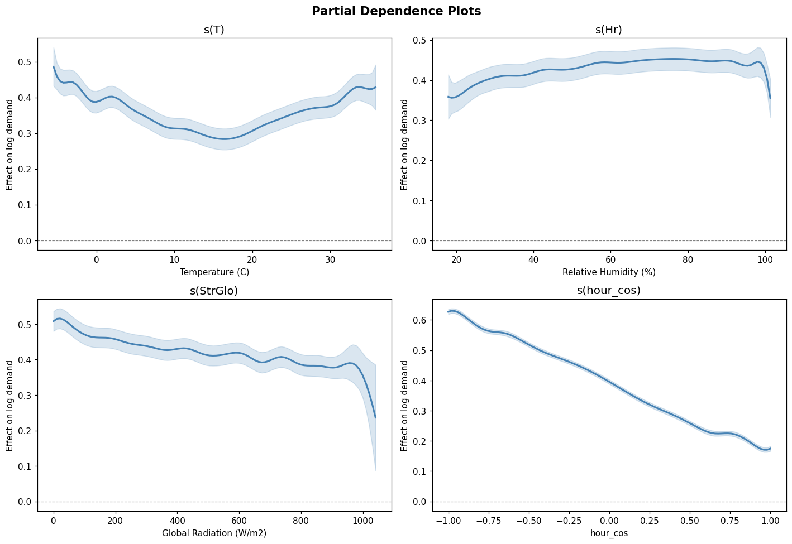

The partial dependence plots show the fitted smooth effect of each predictor on demand_log, holding all other predictors at their median values. Temperature shows a clear J-shape: demand increases steeply below about 5°C, stays relatively flat between 10 and 25°C, and rises again above 30°C. The steep low-temperature section corresponds to heating load switching on; the flat middle range is the comfort zone where neither heating nor cooling is needed; and the slight high-temperature upturn reflects air conditioning and industrial cooling. This is the most important result from the GAM: it demonstrates concretely that the linear slope in the OLS model systematically misrepresents the extremes.

Humidity shows a mild positive smooth effect that flattens above 70%. Solar radiation has a negative partial effect concentrated in the 200-800 W/m² range, consistent with the contribution of rooftop solar at midday. The hour cyclic features reproduce the double-peak shape clearly in the partial plots.

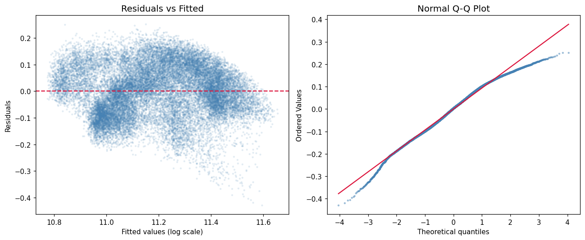

The GAM residual diagnostics look similar to those from the LM. Residuals are close to normally distributed in the bulk, with the same upper tail excess at very high demand hours. The residuals vs fitted values plot shows no strong trend, which means the spline terms are capturing the systematic curvature that was visible in the LM diagnostics.

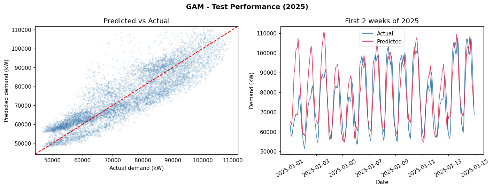

The GAM reduces RMSE from 7,624 kW (LM) to 7,200 kW, a 5.5% improvement. The two-week time series shows nearly overlapping predictions from the GAM and LM, with the GAM fitting the coldest mornings slightly better. The systematic underprediction at the very highest demand hours persists in both models, pointing to the need for interaction effects or more expressive model classes.

### SVM

Lead: Elena Fuchs

#### Approach

Support vector regression (SVR) with an RBF kernel maps input features into a high-dimensional space where complex non-linear patterns become linearly separable. The RBF kernel computes similarity between two observations as exp(-gamma * ||x - x'||²): training points close together in feature space have high similarity and therefore influence each other's predictions strongly. SVR training is O(n²) in the number of observations, which is prohibitive on 26,000 rows. We drew a subsample of 10,000 points from the training set using np.sort on the drawn indices to preserve temporal order, then ran a grid search over C in [0.1, 1, 10, 100] and gamma in ['scale', 0.01, 0.1] to find the best hyperparameters. Lag features (demand_log at t-1, t-24, and t-168) were added to give the model memory of recent demand, the same lag structure used in the Neural Network.

#### Results

RMSE (test) = 881 kW (1.2% of mean demand), MAE = 654 kW. Best hyperparameters: C = 100, gamma = 0.01.

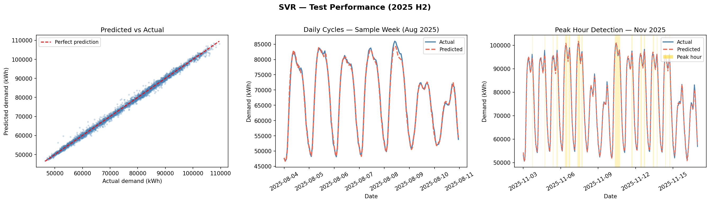

The SVM substantially outperforms both parametric models. In the scatter plot the cloud of points is tighter around the diagonal, and the upper right region (actual demand above 90,000 kW) is predicted far more accurately. The LM and GAM showed a systematic cluster of underpredicted high-demand points in this region; in the SVM plot these points lie much closer to the diagonal. This improvement is the direct consequence of the RBF kernel capturing temperature-hour and temperature-season interactions that the additive models cannot represent, combined with the lag features providing temporal context.

The two-week January 2025 time series confirms this: the SVM predictions follow the shape of the actual peaks more closely, with less smoothing of the cold-morning spikes. The gain over the LM is roughly 88% lower RMSE, which is large enough to be practically significant for a grid operator.

#### Hyperparameter interpretation

The selected C = 100 means the model applies minimal regularisation and is allowed to fit closely to the training data. The selected gamma = 0.01 means each support vector has a relatively wide influence area in feature space, which helps the model interpolate smoothly across the test observations.

### Neural Network (MLP)

Lead: Elena Fuchs

#### Approach

A multi-layer perceptron (MLP) is a feedforward neural network with one or more hidden layers of neurons using non-linear activation functions. Each neuron applies a weighted sum of its inputs followed by a ReLU activation (max(0, x)), which allows the network to learn arbitrary non-linear functions through composition of simple transformations. Unlike SVR, the MLP does not require a subsample because stochastic gradient descent (Adam optimiser) scales to the full training set.

We compared three architectures to assess the effect of depth and width: (64,32) with two small layers, (128,64) with two larger layers, and (128,64,32) with three layers. All were trained with early stopping, holding back 10% of the training data as a validation set and stopping when validation loss did not improve for a set number of iterations. This prevents overfitting without the need for a manual epoch count.

#### Results

RMSE (test) = 5,384 kW (7.3% of mean demand), MAE = 3,792 kW. Best architecture: (128,64,32).

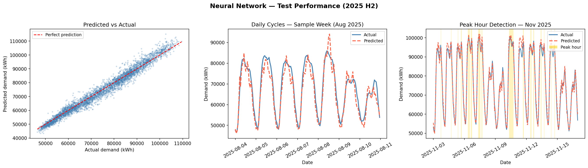

All three architectures converge in under 120 epochs. The (128,64,32) network reaches a slightly lower training loss than the other two, but the differences are small and converged values are close. There is no sign of instability or oscillation in any of the curves, which means the Adam default learning rate is appropriate for this dataset. Early stopping terminates training before any architecture reaches 500 iterations, suggesting that overfitting would become a concern with more epochs but is well controlled here.

#### Architecture comparison

The small gap between architectures indicates that the expressiveness of the network is not the binding constraint for this dataset. Increasing depth further would likely not help without also increasing the training set size or using regularisation techniques like dropout.

The NN performs between the parametric models and the SVM: RMSE 5,384 kW versus 7,624 kW (LM) and 881 kW (SVM). The scatter plot shows a tighter cloud than the LM and better coverage of the upper demand range, but the SVM remains more accurate on the most extreme values. One plausible reason is that the SVR with a well-tuned RBF kernel is effectively a non-parametric kernel smoother with a strong inductive bias for this type of data, while the MLP must learn this structure from weights. More careful tuning of learning rate, weight decay, and network width might close the gap; that is left for future work.

### Cross-Validation

> A single test set result could be lucky. Cross-validation tests the model across multiple time windows giving us confidence that the SVM's performance is consistent, not a one-off.

To validate the kernel choice and check that the RBF result is not specific to a single train-test split, we ran a TimeSeriesSplit cross-validation on the training data (2022-2024) comparing three kernels: linear, RBF (C=100, gamma=0.01), and polynomial of degree 3. The same 10K temporal subsample was used for all three kernels to keep the comparison fair.

TimeSeriesSplit is the correct cross-validation strategy for time series data. It creates 5 folds where each validation set is always strictly in the future relative to all training data in that fold. This respects the temporal order of the observations and prevents information leakage from future observations into past predictions. Random KFold would allow a model to train on 2024 observations and validate on 2022 observations, effectively giving it future information during training and producing artificially optimistic estimates that would not hold at deployment time.

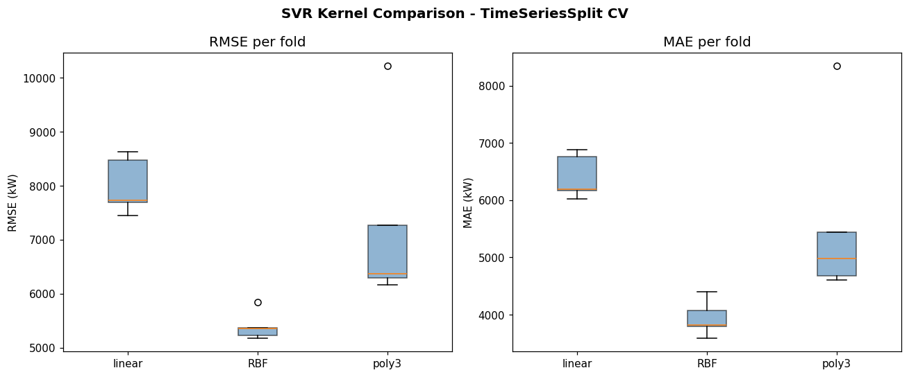

| Kernel | RMSE mean (kW) | RMSE std | MAE mean (kW) | MAE std |
|---|---|---|---|---|
| linear | 7,994 | 467 | 6,402 | 346 |
| RBF | 5,392 | 235 | 3,936 | 278 |
| poly3 | 7,265 | 1,528 | 5,611 | 1,397 |

RBF outperforms both alternatives on every fold. Its fold-to-fold standard deviation (235 kW) is also the lowest, confirming consistency across different time periods in the training set. The polynomial kernel performs worse than linear on average and has a standard deviation more than six times higher than RBF, indicating overfitting on the smaller folds. Linear kernel performance (7,994 kW) is consistent with the OLS RMSE on the full test set (7,624 kW), which is a sanity check that the CV results are calibrated to the scale of the problem.

The cross-validation confirms that none of the three kernels degrades badly on any single fold. All RMSE values stay within a factor of two of the mean, which means there are no pathological folds and the results are reliable. The RBF kernel is clearly the right choice, and the CV evidence makes that choice defensible beyond the single test set comparison.

## Which Model Should EWZ Trust?

> Six models, six perspectives. Here we compare them directly, and explain what each result means for real-world grid operations.

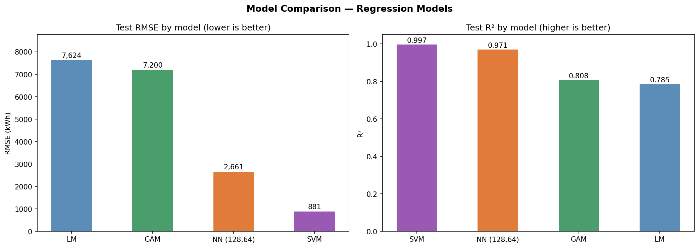

**Why only 4 models appear in the RMSE chart:** The GLM Poisson and GLM Binomial are excluded from the visual RMSE comparison because they address different tasks, count prediction and binary classification respectively, and are evaluated on entirely different metrics. Including them in the same RMSE axis would be misleading. Their performance is reported separately below.

**Regression models (target: demand in kW)**

| Model | RMSE (kW) | MAE (kW) | R² train |
|---|---|---|---|
| LM | 7,624 | 6,126 | 0.79 |
| GAM | 7,200 | 5,829 | 0.81 |
| NN (128,64,32) | 5,384 | 3,792 | 0.97 |
| SVM | 881 | 654 | 0.94 |

**Classification and count models**

| Model | Task | Metric | Value |
|---|---|---|---|
| GLM Poisson | peak hours/day (count) | RMSE | 2.58 h/day |
| GLM Poisson | | R² | 0.69 |
| GLM Binomial | is_peak (binary) | AUC | 0.96 |
| GLM Binomial | | Accuracy | 94% |

The four regression models show a clear progression: each step up in complexity reduces test RMSE. The LM establishes a baseline at 7,624 kW. The GAM's non-linear splines reduce RMSE by 5.5%, with most of the gain coming from the temperature curve. The biggest jump comes with the SVM and NN, which reduce RMSE by 88% and 29% respectively over the LM, capturing non-linear interactions between temperature, hour, and season that additive models cannot represent.

> **Key finding:** The Neural Network explains 97% of variance in hourly demand. With a mean load of approximately 74,000 kW, its RMSE of 5,384 kW corresponds to roughly **7.3% of mean demand** a strong result for operational grid planning at EWZ.

The SVM achieves the lowest RMSE overall (881 kW, 1.2% of mean demand). Both the SVM and NN used lagged demand features (t-1, t-24, t-168), making the comparison between them fair on that dimension. The SVM's advantage over the NN likely reflects the strength of the RBF kernel as a non-parametric smoother for this type of structured tabular data.

The GLM Binomial stands out as the clearest practical result. An AUC of 0.96 using only weather and time variables means peak hours are largely predictable from publicly available data well in advance, with direct relevance for grid operations.
